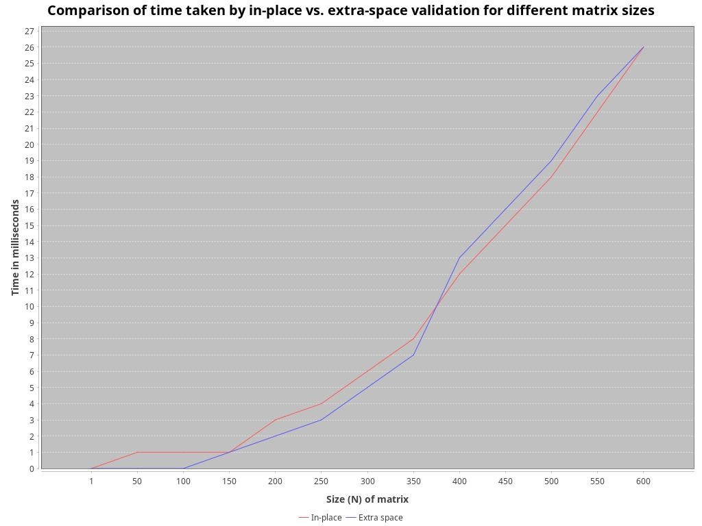

# Latin Square Validator

Takes an N*N size (2-dimensional) matrix and checks it values to determine whether it is a latin square.

In combinatorics and in experimental design, a Latin square is an n × n array filled with n different symbols,
each occurring exactly once in each row and exactly once in each column. An example of a 3×3 Latin square is:

| **1** | **2** | **3** |
|-------|-------|-------|
| **2** | **3** | **1** |
| **3** | **1** | **2** |

This corresponds to { (1, 1, 1), (1, 2, 2), (1, 3, 3), (2, 1, 2), (2, 2, 3), (2, 3, 1), (3, 1, 3), (3, 2, 1), (3, 3, 2) },
where for example the triple (2, 3, 1) means that in row 2 and column 3 there is the symbol 1.

