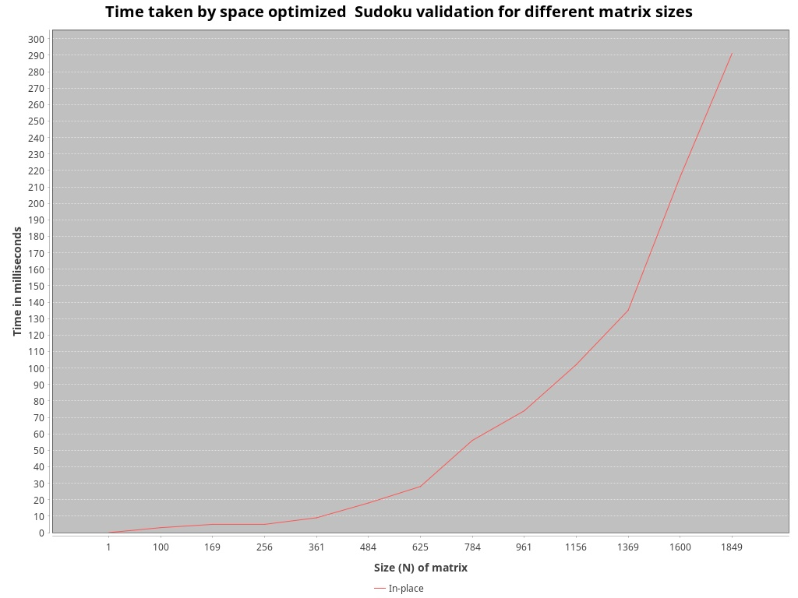
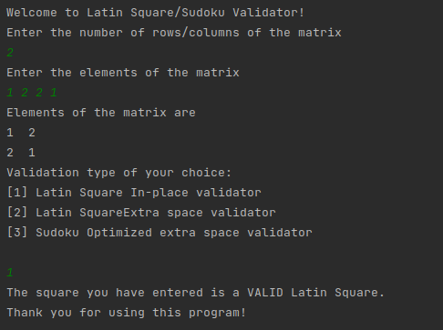
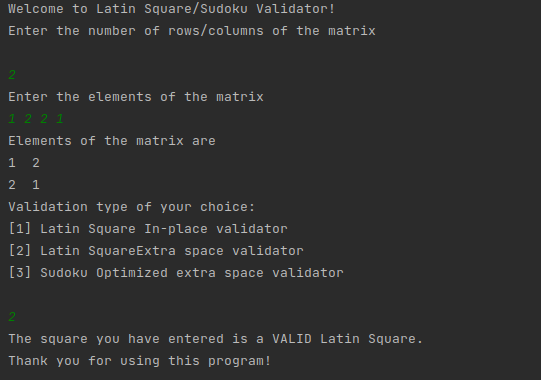

# Latin Square Validator

## Definition

This small application/library takes a 2-dimensional int matrix and checks its values to determine whether it is a valid
latin square.

In combinatorics and in experimental design, a Latin square is an n × n array filled with n different symbols,
each occurring exactly once in each row and exactly once in each column. An example of a 3×3 Latin square is:

| **1** | **2** | **3** |
|-------|-------|-------|
| **2** | **3** | **1** |
| **3** | **1** | **2** |

## Implemented algorithm variants

### 1. In-place validator

This solution walks through the matrix in a diagonal fashion and checks for the uniqueness of values in the rows
as well as the columns content to be equal to the rows. It has a time complexity of `O(2 * n^2 + n) -> O(n^2)`.
The first part of the complexity derives from visiting each element twice when gathering overlapping rows and columns.
The second complexity component (`n`) originates from the removal of all the column elements from the row set to check
whether all elements match. The extra space needed is `O(2 * n) -> O(n)`.

### 2. Extra space validator

This solution optimizes on visiting each element of the matrix just once while traversing in an iterative manner, which
results in exactly `O(n^2)` time complexity. As a tradeoff, the constant extra space required is extended
to `O(n^2 + n) -> O(n^2)`. It stores all the columns values in a dedicated list of sets corresponding to each column,
while the extra space required for the rows validation is always just `n` because the allocated space is reused with
each row iteration.

### 3. Sudoku validator

In order to check the performance of the Sudoku validator solution, performance tests were also performed to check
scalability.
This method is called space optimized as it checks the rows and columns of the matrix, iterating over it only once for
each row and once for each column. The optimized space usage is derived from the approach to use only a `n*Sqrt(n)` size
to store the rows that build up a complete row of subgrids at once. After building up a particular subgrid array while
iterating over the main matrix, the
subgrids are getting immediately validated and the space reused. Thus, the rough time complexity corresponds to
`O(2 *n^2)`, while space complexity is `O(n*Sqrt(n) + 2*n)` given the approach mentioned above, plus the size taken up
by current row/column.

## Performance comparison

While the rough time complexity of both of the solutions in `O(n^2)`, we already saw in the previous sections that there
are already slight differences between them. Theory suggests that the second solution should perform slightly better,
taking in account the fact that nowadays memory is cheap in comparison to time.
The reason why both validator implementations are kept within this solution is the fact that different algorithms can do
well in different circumstances. It is not enough to test a solution theoretically, but the end result depends to a very
large extent on the background implementations of the programming language (i.e. data types or garbage collection).
As we are going to see, these two solutions can perform well in different situations, depending on the data size.

The chart below is a representation of performance results for both of the validators for a `1 to 600` rows/columns
matrix, using a step of `50` and the time value being the average calculated from `100 runs`, excluding the first run to
avoid warmup bias. The runtime calculation strictly includes only the validation runtimes, being free from any
additional code-induced tasks.

As the chart above suggests, the performance is indeed better for extra-space validation for smaller matrices (on my
local machine up to 370 rows and columns). Above that we can see that in-place validation starts to yield more favorable
results. In order to further understand the magnitude of the performance discrepancy for even larger datasets, I created
another runtime comparison for up to a `2000*2000` cells size.

This performance test result shows an increase of the runtime gap between the two solutions, in-place validation
outperforming the extra-space validation in a significant manner. This might be due to Java's memory management as in
case of extra-space validation it also needs to manage a large dataset consisting of `4.000.000` entries for 2000 rows
and columns.

### Conclusion

1. It is very important to check the runtime of different algorithms in theory before implementing them for production
   purposes to filter out bad runtime solutions, but often it is not enough, as the real performance largely depends on
   the background implementations of the language used and possibly other factors, which can only be tested in a
   realistic environment.
2. There is no "bad" solution. Even given the condition above, different solutions can perform better on different size
   of data, this pointing out the importance of adjusting the solution to the scope.

### Sudoku Validator
The Sudoku matrix is valid if each row, column, and submatrix contains all digits from 1 to n without repetition.
This method iterates through each cell in the Sudoku puzzle, and for each cell, it checks whether the current value
occurs in any of the corresponding row, column, and submatrix subsets. If the value has already occurred in any of
the subsets, then the method returns false, indicating that the puzzle is invalid.

The rough time complexity of this implementation corresponds to`O(2 *n^2)`, while space complexity
is `O(n*Sqrt(n) + 2*n)` given the approach mentioned above, plus the size taken up by current row/column. It behaves
similarly as the LatinSquareValidator's extra space implementation, even if in-place validation has been overall
preferred over extra space. It would be worth considering comparing it with other implementation strategies in the future. 

## Types of usage

### 1. As library

Download the (latest) version of `LatinSquare-*.jar` from releases: https://github.com/minimalna/LatinSquare/releases
and import it into your project as a local dependency. Other dependencies listed below can be resolved by using a
dependency management tool such as Gradle or Maven:

- `org.apache.commons:commons-lang3:3.0`

> In the future this project might be published to a central maven/gradle repository, making the library even more
> accessible.

### 2. As stand-alone small command line application

Presumably you already have Java JRE installed on your machine, and Java classpath set.

#### Option 1:

- Download the .jar file from releases: https://github.com/minimalna/LatinSquare/releases
- Open a console, navigate to the project .jar file location and type `java -jar LatinSquare-*.jar` to run the
  application

#### Option 2:

- Download the `LatinSquare-*.tar` or `LatinSquare-*.zip` file from
  releases: https://github.com/minimalna/LatinSquare/releases
- Extract the package you downloaded
- From `/bin` folder, run the executable compatible with your platform

> Examples of running from console:

## Usage as stand-alone application

Following the steps described in the upper section and starting the application, you are now able to validate any `n*n`
size grid, using the keyboard as input source:

- You are prompted to insert the square's dimension.
- Then you have to type the contents manually, separated by a space in one line or multiple lines separated by enter.
- After reading the values in, your input is being displayed in a grid form for visual validation on user's side.
- You are prompted to select the validation type: 1 corresponding to in-place validation method, 2 corresponding to
  extra-space validation, while tye 3 stands for Sudoku validation.
- The validation result is shown.

